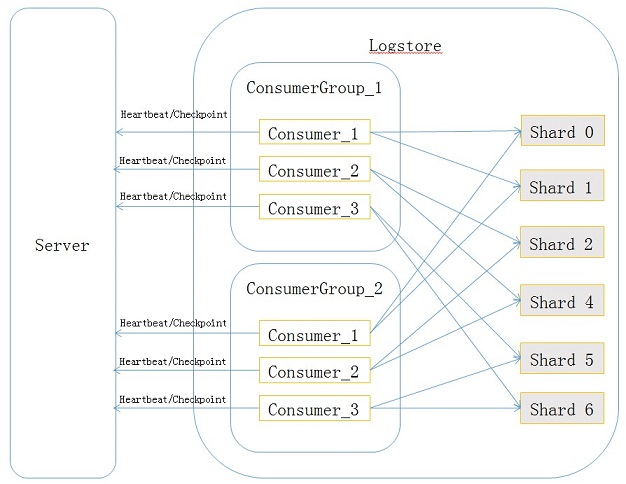
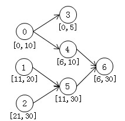
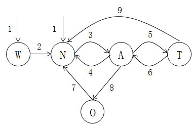

# loghub client library使用说明

## 使用场景
loghub client library是对LogHub消费者提供的高级模式，解决多个消费者同时消费logstore时自动分配shard问题。
例如在storm、spark场景中多个消费者情况下，自动处理shard的负载均衡，消费者failover等逻辑。用户只需专注在自己业务逻辑上，而无需关心shard分配、CheckPoint、Failover等事宜。

举一个例子而言，用户需要通过storm进行流计算，启动了A、B、C 3个消费实例。在有10个shard情况下，系统会自动为A、B、C分配3、3、4个Shard进行消费。
* 当消费实例A宕机情况下，系统会把A未消费的3个Shard中数据自动均衡B、C上，当A恢复后，会重新均衡。
* 当添加实例D、E情况下，系统会自动进行均衡，每个实例消费2个Shard。
* 当Shard有Merge/Split等情况下，会根据最新的Shard信息，重新均衡。
* 当read only状态的shard消费完之后，剩余的shard会重新做负载均衡。

以上整个过程不会产生数据丢失、以及重复，用户只需在代码中做三件事情：

1. 创建Consumer Group。
2. 将实例名注册为Instance，并连接到Consumer Group中。
3. 写处理日志的代码。

**我们强烈建议使用loghub client library进行数据消费，这样您只需要关心怎么处理数据，而不需要关注复杂的负载均衡、消费断点保存、按序消费、消费异常处理等问题**。

## 术语简介
loghub client library中主要有4个概念，分别是consumer group、consumer、heartbeat和checkpoint，它们之间的关系如下：



* consumer group

    是logstore的子资源，拥有相同consumer group 名字的消费者共同消费同一个logstore的所有数据，这些消费者之间不会重复消费数据，一个logstore下面可以最多创建5个consumer group，不可以重名，同一个logstore下面的consumer group之间消费数据不会互相影响。consumer group有两个很重要的属性：
```
{
	"order":boolean,
	"timeout": integer
}
```
order属性表示是否按照写入时间顺序消费key相同的数据，timeout表示consumer group中消费者的超时时间，单位是秒，当一个消费者汇报心跳的时间间隔超过timeout，会被认为已经超时，服务端认为这个consumer此时已经下线了。
* consumer

    消费者，每个consumer上会被分配若干个shard，consumer的职责就是要消费这些shard上的数据，同一个consumer group中的consumer必须不重名。

* heartbeat

    消费者心跳，consumer需要定期向服务端汇报一个心跳包，用于表明自己还处于存活状态。
* checkpoint

    消费者定期将分配给自己的shard消费到的位置保存到服务端，这样当这个shard被分配给其它消费者时，从服务端可以获取shard的消费断点，接着从断点继续消费数据。

## 实现原理

### 通信协议

定义如下消费者和服务端的通信接口：
```java
/*
	创建consumr group，inOrder表示是否希望key相同的数据能够按照写入的时间顺序被消费，
	timeoutInSec表示consumer的心跳超时时间，超过timeoutInSec没有汇报心跳的consumer会被认为已经下线了，建议取值20s左右。
*/
boolean CreateConsumerGroup(
			String project, 
			String logstore, 
			String consumerGroupName, 
			boolean inOrder,
			int timeoutInSec);
/*
	删除consumer group
*/
boolean DeleteConsumerGroup(
			String project, 
			String logStore, 
			String consumerGroup);
/*
	列出logstore下所有的consumer group，包括每个consumer group的order、timeout属性
*/
List<ConsumerGroup> ListConsumerGroup(
			String project, 
			String logStore);
/*
	更新consumer group的属性，consumer group的名字不可以更新，如果将inOrder由true更新为false，
	那么当前所有未开始消费的shard将会被分配至各个consumer，如果inOrder由false更新为true，对于当前正在消费的shard不会生效，
	也就是说即使shard之间有父子关系，由于它们都已经被消费了，所以顺序对他们而言没有意义，但是inOrder属性更新之后，shard分裂和合并产生的新的shard将会被顺序消费。
*/
boolean UpdateConsumerGroup(
			String project,
			String logStore,
			String consumerGroup,
			boolean inOrder,
			int timeoutInSec
			);
/*
	更新shard消费到的位置，只有当参数中的shard当前由consumer持有的情况下才能更新成功
*/
boolean UpdateCheckPoint(
			String project, 
			String logStore, 
			String consumerGroup, 
			String consumer,
			int shard,
			String checkpoint);
/*
	更新shard消费到的位置，无论如何都可以更新成功
*/
boolean UpdateCheckPoint(
			String project, 
			String logStore, 
			String consumerGroup, 
			int shard,
			String checkpoint);
/*
	获取consumer group中shard的消费断点
*/
String GetCheckPoint(
			String project,
			String logStore,
			String consumerGroup,
			int shard);
/*
	获取consumer group中所有shard的消费断点，返回结果是一个断点的List，具体请参考sdk
*/
List<ShardCheckPoint> GetCheckPoint(
			String project,
			String logStore,
			String consumerGroup);
/*
	将当前consumer持有的shard汇报给服务端，服务端返回确认包，里面包含若干shard，假设持有的shard集合为A，返回的确认shard集合为B，
	A和B的差集(A-B)表示consumer应该放弃消费的shard，consumer应该尽快将(A-B)中的shard的消费断点保存到服务端，并放弃消费(A-B)中的shard，
	(B-A)表示consumer可以增持的shard，consumer从服务端获取(B-A)中shard的checkpoint。理想状态下下一次心跳汇报给服务端的shard集合就是B，
	但是如果consumer不想(没来得及)放弃A-B中的某些shard，需要将这些shard一并汇报给服务端。
	Heartbeat除了上面有消费负载均衡的功能以外，还用于告知服务端自己处于存活状态，不要将自己从consumer group中删除。一旦heartbeat超时，
	服务端就会将consumer从consumer group中删除，并将分配给其的shard重新分配给别的consumer。
*/
List<Integer> HeartBeat(
			String project,
			String logStore,
			String consumerGroup,
			String consumer,
			ArrayList<Integer> shards
			)

```

### 有限状态自动机

服务端对consumer group中每个shard都会维护一个有限状态自动机，共有五种状态，分别是already_alloc、not_alloc、wait、transfer、over，每种状态的含义如下：

> already_alloc：该shard已经被某个consumer持有并消费。

> not_alloc：该shard可以消费，但是尚未被任何consumer持有。

> wait：该shard当前不可以消费，需要等待其祖先shard消费完。

> transfer：将该shard转交给另一个消费者消费的过渡状态。只有当当前消费者在Heartbeat中放弃消费该shard，才能将该shard转交出去，因此需要这个过渡状态。

> over：该shard的数据已经消费完。

wait状态需要重点说明下，假设某个时刻数据仓库所有shard的关系如下图：



初始时有3个shard 0、1、2，每个shard下面的区间表示关联的hash值的集合，这里为了简单用数值型表示hash key，此时hash值为7的数据会被写入shard 0，随后0 split成3和4，shard 0变成read_only状态，shard 3和4变成read_write状态，这个时候hash值是7的数据不会再被写入shard 0，而是写入shard 4，再接着shard 4和5 merge成6之后，hash值为7的数据只会写入shard 6。

如果要顺序消费hash值为7的数据，必须保证在shard 0被消费完之前shard 4不应该被任何消费者消费，同理，shard 6不应该在shard 4中数据消费完之前被消费，我们把shard 0、4认为是shard 6的祖先，shard 6称为shard 0和4的后代，某个shard可以被消费当且仅当其祖先shard中的数据被消费完。基于这个原因，引入wait状态表示该shard当前不可以被消费。

状态转移图如下：



图中每个状态用首字母缩写表示，每条边对应含义如下：

> 1 表示shard的起始状态只能是wait或者not_alloc。

> 2 表示该shard的祖先shard的数据已经被消费完，可以开始消费当前shard的数据了。

> 3 表示该shard被分配给了某一个消费者。

> 4 表示消费该shard的consumer心跳超时了，回收其持有的shard。

> 5 表示持有该shard的消费者持有的shard总数太多，不满足任意两个消费者持有shard数量之差的绝对值小于等于1，所以将该shard转移给别的需要的消费者消费，这时会将等待消费的消费者(next consumer)和这个shard关联起来。

> 6 表示收到持有该shard的consumer放弃消费的Heartbeat，并将该shard转移给关联的next consumer持有。发生该转移还有一种可能是该shard的next consumer超时，继续由持有该shard的消费者持有该shard。

> 7 表示当强制更新over状态的shard的消费断点到某个非数据结束位置时，该shard恢复可消费状态。执行这种更新操作要特别当心，因为该shard的后代shard可能已经被消费了，很可能导致数据无法按照hash key的顺序消费。

> 8 表示read_only状态的shard数据被消费完了。

> 9 表示持有该shard的消费者Heartbeat超时，回收该shard到not_alloc状态。

这里要注意以下几点：
* shard 处于transfer状态时，服务端收到持有该shard的消费者的Heartbeat时，返回的确认shard集合中不会包含该shard，确认shard集合中只会包含持有者是该consumer并且shard状态是already_alloc的shard。
* 消费者调用UpdateCheckpoint更新消费断点，如果是read_only状态的shard要检查该checkpoint是否是shard的结尾，如果是就需要将shard状态转移成over。
* 5 标识的转移是保证任意两个消费者持有shard数量之差的绝对值小于等于1的基础，当发现有consumer持有的shard数量不满足该条件时，从shard持有数量多的消费者那里剥夺一些shard，分配给持有数量少的consumer，这个过程称为消费负载均衡。这些将要易手的shard需要设置成transfer状态，以等待持有者heartbeat中确认放弃，这主要是为了让持有者收到放弃消息时将消费断点保存到服务端，从而易手之后，新的consumer可以从服务端获取该shard的消费断点。
* 新的shard加入时，只能由转移1进入，其状态为wait当该shard有祖先shard，并且其祖先没有消费完，否则状态为not_alloc。
* 消费的负载均衡只会考虑not_alloc、already_alloc、transfer状态的shard，wait和over状态的shard由于不满足消费条件，所以不会被分配给任何consumer。

## 如何使用loghub client library

* 实现loghub client library中的两个接口类：
	* ILogHubProcessor // 每个shard对应一个实例，每个实例只消费特定shard的数据。
	* ILogHubProcessorFactory // 负责生产实现ILogHubProcessor接口实例。
* 填写参数配置。 
* 启动一个或多个client worker实例。

## 使用sample 

### main函数

```
	public static void main(String args[]) 
	{
		LogHubConfig config = new LogHubConfig(...);

        ClientWorker worker = new ClientWorker(new SampleLogHubProcessorFactory(), config);

        Thread thread = new Thread(worker);
        //thread运行之后，client worker会自动运行，ClientWorker扩展了Runnable接口。
        thread.start();
        //调用worker的shutdown函数，退出消费实例，关联的线程也会自动停止。
        worker.shutdown();
        //ClientWorker运行过程中会生成多个异步的Task，shutdown之后最好等待还在执行的Task安全退出，建议30s。
        Thread.sleep(30 * 1000);
	}

```
### ILogHubProcessor、ILogHubProcessorFactory 实现sample
* 各个shard对应的消费实例类，实际开发过程中用户主要需要关注数据消费逻辑，同一个ClientWorker实例是串行消费数据的，只会产生一个ILogHubProcessor实例，ClientWorker退出的时候会调用ILogHubProcessor的shutdown函数。
```
public class SampleLogHubProcessor implements ILogHubProcessor 
{
	private int mShardId;
	// 记录上次持久化check point的时间
	private long mLastCheckTime = 0; 
	
	public void initialize(int shardId) 
	{
		mShardId = shardId;
	}

	// 消费数据的主逻辑
	public String process(List<LogGroupData> logGroups,
			ILogHubCheckPointTracker checkPointTracker) 
	{
		for (LogGroupData group : logGroups) 
		{
			List<LogItem> items = group.GetAllLogs();
			for (LogItem item : items) 
			{
			    // 打印loggroup中的数据
				System.out.println("shard_id:" + mShardId + " " + item.ToJsonString());
			}
		}
		long curTime = System.currentTimeMillis();
		// 每隔60秒，写一次check point到服务端，如果60秒内，worker crash，
		// 新启动的worker会从上一个checkpoint其消费数据，有可能有重复数据
		if (curTime - mLastCheckTime >  60 * 1000) 
		{
			try 
			{
				checkPointTracker.saveCheckPoint(true);
			} 
			catch (LogHubCheckPointException e) 
			{
				e.printStackTrace();
			}
			mLastCheckTime = curTime;
		} 
		else 
		{
			try 
			{
				checkPointTracker.saveCheckPoint(false);
			} 
			catch (LogHubCheckPointException e) 
			{
				e.printStackTrace();
			}
		}
		// 返回空表示正常处理数据， 如果需要回滚到上个check point的点进行重试的话，可以return checkPointTracker.getCheckpoint()
		return null;  
	}
	// 当worker退出的时候，会调用该函数，用户可以在此处做些清理工作。
	public void shutdown(ILogHubCheckPointTracker checkPointTracker) 
	{
	    //将消费断点保存到服务端。
	    try {
			checkPointTracker.saveCheckPoint(true);
		} catch (LogHubCheckPointException e) {
			e.printStackTrace();
		}
	}
}
```

* 生成 ILogHubProcessor的工厂类 ：
```
public class SampleLogHubProcessorFactory implements ILogHubProcessorFactory 
{
    public ILogHubProcessor generatorProcessor()
    {   
        // 生成一个消费实例
    	return new SampleLogHubProcessor();
    }
}
```
### 配置说明：

```
public class LogHubConfig 
{
    //worker默认的拉取数据的时间间隔
	public static final long DEFAULT_DATA_FETCH_INTERVAL_MS = 200;
	//consumer group的名字
	private String mConsumerGroupName;
	//consumer的名字，必须确保同一个consumer group下面的各个consumer不重名
	private String mWorkerInstanceName;
	//loghub数据接口地址
	private String mLogHubEndPoint;
	//项目名称
	private String mProject;
	//日志库名称
	private String mLogStore;
	//云账号的access key id
	private String mAccessId;
	//云账号的access key
	private String mAccessKey;
	//用于指出在服务端没有记录shard的checkpoint的情况下应该从什么位置消费shard，取值可以是[BEGIN_CURSOR, END_CURSOR, SPECIAL_TIMER_CURSOR]中的一个
	private LogHubCursorPosition mCursorPosition;
	//当mCursorPosition取值为SPECIAL_TIMER_CURSOR时，指定消费时间，单位是秒。
	private int  mLoghubCursorStartTime = 0;
	// 轮询获取loghub数据的时间间隔，间隔越小，抓取越快，单位是ms，默认是DEFAULT_DATA_FETCH_INTERVAL_MS,建议取值200ms以上
	private long mDataFetchIntervalMillis;
	// worker想服务端汇报心跳的时间间隔，单位是毫秒，建议取值10000ms以上。
	private long mHeartBeatIntervalMillis;
	//是否按序消费
	private boolean mConsumeInOrder; 
}
```
### Maven配置
```
<dependency>
  <groupId>com.aliyun</groupId>
  <artifactId>sls-loghub-client-inner</artifactId>
  <version>0.2.6</version>
</dependency>
```
## 常见问题&注意事项
* LogHubConfig 中 consumerGroupName表一个消费组，consumerGroupName相同的consumer分摊消费logstore中的shard，同一个consumerGroupName中的consumer，通过workerInstance name进行区分。 
```
假设logstore中有shard 0 ~ shard 3 这4个shard。
有3个worker，其consumerGroupName和workerinstance name分别是 : 
<consumer_group_name_1 , worker_A>，
<consumer_group_name_1 , worker_B>，
<consumer_group_name_2 , worker_C>
则，这些worker和shard的分配关系是：
<consumer_group_name_1 , worker_A>: shard_0, shard_1
<consumer_group_name_1 , worker_B>: shard_2, shard_3
<consumer_group_name_2 , worker_C>: shard_0, shard_1, shard_2, shard_3  # group name不同的worker相互不影响
```
* 确保实现的ILogHubProcessor process()接口每次都能顺利执行，并退出，这点很重要。
* ILogHubCheckPointTracker的saveCheckPoint()接口，无论传递的参数是true，还是false，都表示当前处理的数据已经完成，参数为true，则立刻持久化至服务端，false则每隔60秒同步一次到服务端。
* LogHubConfig中配置的是子用户的accessKeyId、accessKey，需要在RAM中进行以下授权,详细内容请参考[API文档](https://help.aliyun.com/document_detail/sls/api/ram/overview.html?spm=5176.docsls/api/ram/resources.6.136.0FbVOy)：

|Action|Resource|
|--------------|--------------|
|log:GetCursorOrData|acs:log:**${regionName}**:**${projectOwnerAliUid}**:project/**${projectName}**/logstore/**${logstoreName}**|
|log:CreateConsumerGroup|acs:log:**${regionName}**:**${projectOwnerAliUid}**:project/**${projectName}**/logstore/**${logstoreName}**/consumergroup/*|
|log:ListConsumerGroup|acs:log:**${regionName}**:**${projectOwnerAliUid}**:project/**${projectName}**/logstore/**${logstoreName}**/consumergroup/*|
|log:ConsumerGroupUpdateCheckPoint|acs:log:**${regionName}**:**${projectOwnerAliUid}**:project/**${projectName}**/logstore/**${logstoreName}**/consumergroup/**${consumerGroupName}**|
|log:ConsumerGroupHeartBeat|acs:log:**${regionName}**:**${projectOwnerAliUid}**:project/**${projectName}**/logstore/**${logstoreName}**/consumergroup/**${consumerGroupName}**|
|log:GetConsumerGroupCheckPoint|acs:log:**${regionName}**:**${projectOwnerAliUid}**:project/**${projectName}**/logstore/**${logstoreName}**/consumergroup/**${consumerGroupName}**|